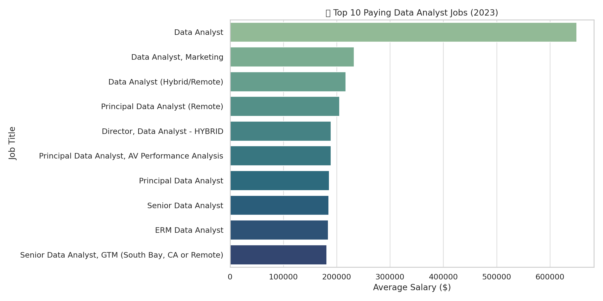
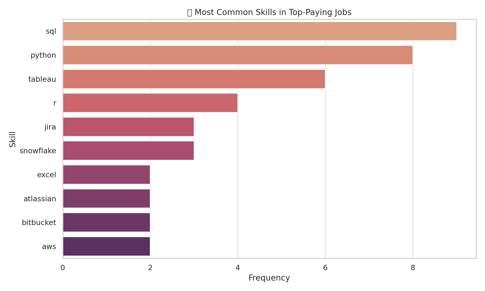
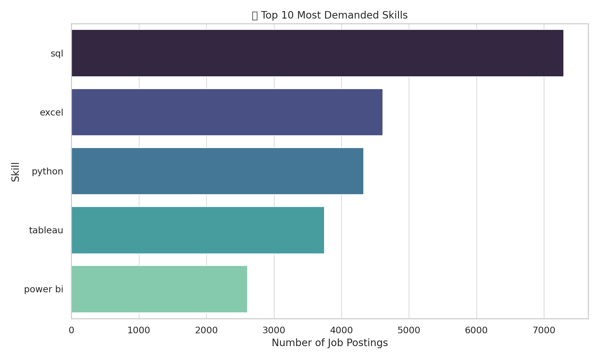
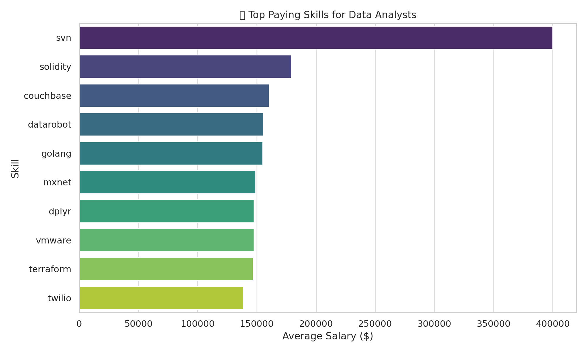
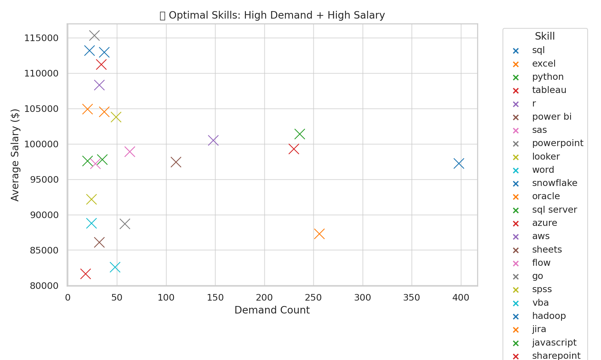

# 📊 Data Analyst Job Market Insights (2023)

Welcome to the **Data Analyst Job Market Dashboard** project! This portfolio project explores the intersection of demand, compensation, and skill requirements for data analyst roles based on real-world job data from 2023.

---

## 🧠 Project Overview

This project answers **5 key questions** every aspiring or current data analyst wants to know:

1. **What are the top 10 paying data analyst jobs?**
2. **What skills are required for top-paying data analyst roles?**
3. **What are the most in-demand skills in the job market?**
4. **What skills command the highest salaries?**
5. **What are the most optimal skills to learn?** (high demand + high salary)

---

## 📁 Datasets Used

| File Name                                 | Description                                      |
|------------------------------------------|--------------------------------------------------|
| `1_top_10_mostpaying_data_analyst_jobs.csv` | Top 10 highest-paying data analyst job listings |
| `2_skills_required_for_top_paying_data_analyst.csv` | Skill breakdown per top-paying role             |
| `3_top_demanded_skills.csv`              | Demand counts of data analyst skills            |
| `4_skills_based_on_salary.csv`           | Average salaries by skill                       |
| `5_optimal_skills.csv`                   | High-paying AND high-demand skill combinations  |

---

## 🧾 Key Insights

### 1. 💰 **Top 10 Paying Data Analyst Jobs**
- **Mantys** leads with a $650,000+ job listing.
- Remote, healthcare, and marketing analyst roles dominate top salaries.

### 2. 🛠️ **Top Skills in High-Paying Jobs**
- **SQL, Python, Tableau, R, and Hadoop** appear consistently.
- Advanced tech stacks (like Snowflake, Oracle, Hadoop) add salary weight.

### 3. 📈 **Most In-Demand Skills**
- **SQL, Excel, and Python** top job listings.
- Visualization tools like Tableau and Power BI are strongly in demand.

### 4. 💸 **Top Paying Skills**
- **SVN, Solidity, Couchbase, Datarobot, and Golang** lead salary rankings.
- Niche or advanced technologies often offer the highest pay.

### 5. 🎯 **Most Optimal Skills to Learn**
- **Python, SQL, Tableau, R, Excel** provide the best blend of high pay and high demand.
 

## 📌 Recommendation for Aspiring Analysts

Focus on mastering:
- **Python** for data manipulation
- **SQL** for querying large datasets
- **Tableau or Power BI** for insights storytelling
- **Excel** for business users
- **R** if you're targeting research-heavy or statistical roles